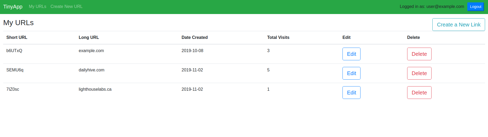

# TinyApp Project

TinyApp is a full stack web application built with Node and Express that allows users to shorten long URLs (à la bit.ly).

## Final Product Screenshot

## Dependencies

- Node.js
- Express
- EJS
- bcrypt
- body-parser
- cookie-session

## DevDependencies

- Mocha/Chai
- Nodemon

## Getting Started

- Install all dependencies (using the `npm install` command).
- Run the development web server using the `node express_server.js` command.
